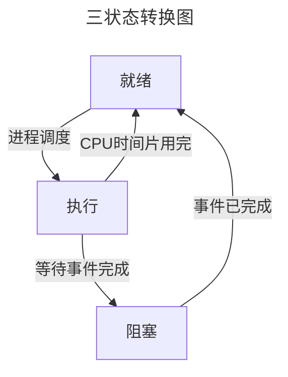
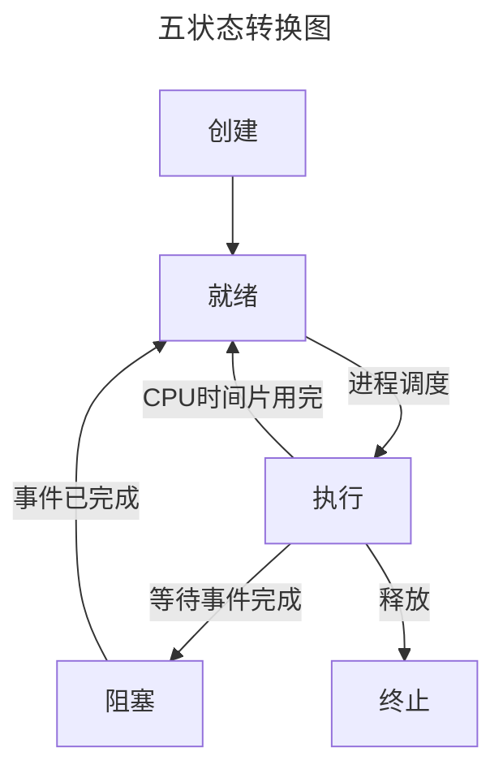

> 进程：资源分配的独立单位
> 线程：资源调度的独立单位

#### 进程之间私有和共享的资源

- 私有：地址空间、堆、全局变量、栈、寄存器
- 共享：代码段，公共数据，进程目录，进程 ID

#### 线程之间私有和共享的资源

- 私有：线程栈，寄存器，程序计数器
- 共享：堆，地址空间，全局变量，静态变量

[五分钟扫盲：进程与线程基础必知 - 知乎](https://zhuanlan.zhihu.com/p/403313422)

# 一、进程

### 1.1 进程概念

[可执行程序内存分配](可执行程序内存分配.md)

> 进程是程序的一次执行过程，程序是静态的，作为系统中的一种资源永远存在的。而进程是动态的，动态产生，变化和消亡的，拥有其自己的生命周期

**进程是程序在某个数据集合上的一次运行活动，也是操作系统进行资源分配和保护的基本单位**

### 1.2 进程组成

##### 1.2.1 进程控制块(PCB) -> 操作系统使用

##### 1.2.2 数据段 -> 进程使用

- Data 段：初始化后的静态(全局)数据
- BSS 段：未初始化的静态(全局)数据

##### 1.2.3 程序段(Text)-> 进程使用

同一程序的进程此部分相同，只读的方式加载到内存中，可被多个进程安全共享

### 1.3 进程状态

[【操作系统】进程及进程的基本状态及转换图-CSDN 博客](https://blog.csdn.net/Jacky_Feng/article/details/108289943)

> 阻塞态是由于缺少需要的资源从而由运行态转换而来，但是该资源不包括 CPU 时间片，缺少 CPU 时间片会从运行态转换为就绪态
>
> 只有就绪态和运行态可以相互转换，其它的都是单向转换
> 1.3.1~1.3.3 为三种基本状态；1.3.1~1.3.5 为五种基本状态





##### 1.3.1 就绪态(ready)

进程具备运行条件，等待系统分配 CPU 即可立即运行

##### 1.3.2 运行态(running)

进程占用 CPU 运行中

##### 1.3.3 阻塞态(wait)

正在执行的进程由于等待某个事件完成而无法继续运行的状态

##### 1.3.4 新建态(new)

进程正在被创建时的状态

##### 1.3.5 终止态(exit)

进程正在从系统中消失时的状态

### 1.4 进程空间分布

[Linux 进程地址空间与进程内存布局详解 - 知乎](https://zhuanlan.zhihu.com/p/348171413)

Linux 系统进程的标准内存端布局：


32 位 Linux 的虚拟地址空间范围为 0 ～ 4G，Linux 内核将这 4G 字节的空间分为两部分， 将最高的 1G 字节（从虚拟地址 0xC0000000 到 0xFFFFFFFF）供内核使用，称为“内核空间”。而将较低的 3G 字节（从虚拟地址 0x00000000 到 0xBFFFFFFF）供各个进程使用，称为“用户空间。因为每个进程可以通过系统调用进入内核，因此，Linux 内核由系统内的所有进程共享。于是，从具体进程的角度来看，每个进程可以拥有 4G 字节的虚拟空间

不管是内核空间还是用户空间，它们都处于虚拟空间中。 虽然内核空间占据了每个虚拟空间中的最高 1GB 字节，但映射到物理内存却总是从最低地址（0x00000000），另外， 使用虚拟地址可以很好的保护内核空间被用户空间破坏，虚拟地址到物理地址转换过程由操作系统和 CPU 共同完成(操作系统为 CPU 设置好页表，CPU 通过 MMU 单元进行地址转换)

[操作系统 -- 虚拟地址与物理地址 - 牛犁 heart - 博客园](https://www.cnblogs.com/whiteBear/p/16299264.html)

##### 1.4.1 虚拟地址

可执行程序进程空间对应的地址，可用`objdump`反编译可执行文件得到对应汇编程序，其中左侧数据就是虚拟地址，该虚拟地址由**链接器**生成

##### 1.4.2 物理地址

内存条上的实际可寻址地址，即程序中变量在内存中的实际存储位置

##### 1.4.3 虚拟地址到物理地址的转换

- 转换函数: $p=f(v)$，其中 v 为虚拟地址，p 为物理地址
- 实现方式：内存管理单元(MMU) -> 硬件，将虚拟地址映射到真实物理地址上去；其中把虚拟地址空间和物理地址空间都分成同等大小的块，也称为页，按照虚拟页和物理页进行转换。根据软件配置不同，这个页的大小可以设置为 4KB、2MB、4MB、1GB，这样就进入了现代内存管理模式——分页模型

### 1.5 父子进程

[Linux 进程-----父进程与子进程（详细篇）-CSDN 博客](https://blog.csdn.net/qq_66337990/article/details/132589191)
[【Linux】撕开 fork 的本质，深入了解 fork 函数原理-CSDN 博客](https://blog.csdn.net/2403_86785171/article/details/141370035)
[关于 fork 函数中的内存复制和共享 - 黑翼天使 23 - 博客园](https://www.cnblogs.com/bwangel23/p/4190043.html)

> Linux 系统上使用 fork()创建子进程，刚创建出来的子进程和父进程"**几乎**"一模一样；每个进程只有一个父进程，但能有多个子进程，子进程复制父进程的数据空间(数据段)、栈和堆(当有数据修改时)，父、子进程共享正文段(代码段)
> 子进程的代码段、数据段和堆栈段通常会与父进程在内存中的位置相同，但是在物理内存中是独立的。操作系统使用了写时复制（Copy-On-Write，COW）机制来实现这一点。在子进程创建后，当父进程或子进程中的某个进程尝试修改它们的共享数据时，操作系统会将要修改的数据复制到新的物理内存页中，使得父子进程的数据修改不会互相干扰。所以子进程是和父进程先共用空间，到数据不同时在创建。
> 相当于只有发生数据更改时，子进程就会根据需要创建一块内存来存放与父进程不同的数据。因此，通过  `fork()`  函数创建的子进程实际上被放置在与父进程相同的虚拟地址空间中，但在物理内存中是独立的。这样可以节省内存空间，同时确保父子进程之间的独立性

##### 1.5.1 父进程与子进程

- 子进程与父进程相同的属性：

A)  实际  UID  和  GID，以及有效  UID  和  GID。
B)  所有环境变量。
C)  进程组  ID  和会话  ID。
D)  当前工作路径。除非用 chdir()加以修改
E)  打开的文件。
F)  信号响应函数。
G)  整个内存空间，包括栈、堆、数据段、代码段、标准  IO  的缓冲区等等。

- 子进程与父进程不同的属性：

A)  进程号  PID 。PID  是身份证号码，哪怕亲如父子，也要区分开。
B)  记录锁。父进程对某文件加了把锁，子进程不会继承这把锁。
C)  挂起的信号。这些信号是所谓的“悬而未决”的信号，等待着进程的响应，子进程也不会继承这些信号。

- 子进程会从 fork( )返回值后的下一条逻辑语句开始运行。这样就避免了不断调用 fork( )而产生无限子孙的悖论。

- 父子进程是相互平等的：他们的执行次序是随机的，或者说他们是并发运行的，除非使用特殊机制来同步他们，否则不能判断他们的运行究竟谁先谁后。

- 父子进程是相互独立的：由于子进程完整地复制了父进程的内存空间，因此从内存空间的角度看他们是相互独立、互不影响的。

### 1.6 进程上下文

[Linux：上下文，进程上下文和中断上下文概念，上下文切换-CSDN 博客](https://blog.csdn.net/lqy971966/article/details/119103989)

处理器总处于以下三种状态之一：  
１、内核态，运行于进程上下文，内核代表进程运行于内核空间；  
２、内核态，运行于中断上下文，内核代表硬件运行于内核空间；  
３、用户态，运行于用户空间。

##### 1.6.1 进程上下文

可以看作是用户进程传递给内核的这些参数以及内核要保存的那一整套的变量、寄存器值和当时的环境等信息

##### 1.6.2 进程调度引起的进程切换(上下文切换)

当内核需要切换到另一个进程时，它需要保存当前进程的所有状态， 即保存当前进程的上下文，以便再次执行该进程时，能够回到切换时的状态继续执行下去

##### 1.6.3 进程上下文组成部分

- 用户级上下文：用户空间的数据、堆栈及共享存储区
- 寄存器上下文：通用寄存器、程序寄存器(IP)、处理器状态寄存器(EFLAGS)、栈指针(ESP)
- 系统级上下文：进程控制块 task_struct、内存管理信息(mm_struct、vm_area_struct、pgd、pte)、内核栈

### 1.7 孤儿进程、僵尸进程和守护进程

- [孤儿进程与僵尸进程[总结]](https://www.cnblogs.com/Anker/p/3271773.html)

> 在 Unix/Linux 系统中，正常情况下，除 init 进程外的其他进程都是通过父进程创建的，子进程又继续创建它的子进程。

##### 1.7.1 孤儿进程(由 init 处理，危害性不大)

当父进程因为某些原因没有等待创建的子进程退出就提前结束，此时的子进程就是孤儿进程，此时孤儿进程的父进程会变为 init 进程

##### 1.7.2 僵尸进程(占用进程号，危害性较大)

当子进程退出时，父进程没有调用 wait()或 waitpid()获取子进程状态信息，导致子进程的进程描述符等信息仍然存在于系统中，此时的子进程就是僵尸进程，直到父进程处理或者父进程被终止时才会消失；若父进程是死循环，那么该僵尸进程就会一直消耗内存空间和进程号

处理僵尸进程的方式：
[Linux 僵尸进程的处理方式 - Jcpeng_std - 博客园](https://www.cnblogs.com/JCpeng/p/15269661.html)

- 杀掉僵尸进程的父进程

```bash
# 查找僵尸进程相关信息
$ ps -e -o stat,ppid,pid,cmd | egrep '^[Zz]'
# 杀掉父进程pid号
$ kill -9 <ppid>
```

- 父进程中调用 wait()/waitpid()函数
- 父进程接收到 SIGCHLD 信号后调用 wait()/waitpid()函数对子进程进行处理，释放其子进程占用的资源 -> 当一个子进程终止或停止时，会向其父进程发送 SIGCHLD 信号。这个信号默认情况下会被忽略，但可以通过注册信号处理器来控制父进程释放子进程占用的资源

##### 1.7.3 守护进程

[【Linux】守护进程（ Daemon）的定义，作用，创建流程](https://blog.csdn.net/JMW1407/article/details/108412836)

脱离终端在后台运行的程序，通常以 d 结尾，随系统启动而启动，父进程通常为 init 进程，可按照下面描述方法创建守护进程，也可通过库函数 daemon()创建守护进程

- 如何创建守护进程
  > 1.使用 fork()创建子进程并让父进程先于子进程结束，使子进程变为孤儿进程
  >
  > 2.在该孤儿进程中调用 setsid()函数创建**新的会话** ->使原本拷贝自父进程的会话、进程组和控制终端等信息的子进程独立出来
  >
  > 3.从子进程再次调用 fork()创建一个子进程(孙子进程)并结束掉原本的子进程，使得该孙子进程真正成为孤儿进程(守护进程)-> 有可能原本的父进程创建出子进程后因为某种原因阻塞，而子进程提前退出导致成为僵尸进程而非孤儿进程；而子进程再次创建孙子进程后立即退出，这时候可以保证孙子进程是孤儿进程而非僵尸进程
  >
  > 4.在孙子进程中调用 chdir()使根目录`/`成为该进程的工作目录
  >
  > 5.在孙子进程中调用 umask()设置进程文件权限掩码为 0
  >
  > 6.在孙子进程中关闭任何不需要的文件描述符，例如文件描述符为 0,1,2 的三个文件(标准输入、标准输出和标准错误输出)
  >
  > 7.处理守护进程的退出操作：编写代码实现 kill 发出的 signal 信号处理，实现该进程的正常退出

### 中断上下文

- **中断上下文(原子上下文)，就是硬件传递过来的这些参数和内核需要保存的一些其他环境（主要是当前被打断执行的进程环境）**
- 中断上下文切换：在发生中断时,内核就在被中断进程的上下文中，在内核态下执行中断服务例程。但同时会保留所有需要用到的资源，以便中继服务结束时能恢复被中断进程的执行。

# 二、线程

### 2.1 线程概念

> 线程是操作系统能够进行运算调度的最小单位。它被包含在进程之中，是进程中的实际运作单位
> 一条线程指的是进程中一个单一顺序的控制流，一个进程中可以并发多个线程，每条线程并行执行不同的任务

### 2.2 一个进程最多可以创建的线程数

[被问懵了：一个进程最多可以创建多少个线程？ - 小林 coding - 博客园](https://www.cnblogs.com/xiaolincoding/p/15013929.html)

一个进程可以创建的线程数由**进程的虚拟内存空间大小**和**系统参数**决定

##### 32 位 Linux 系统

一个进程虚拟空间为 4G，内核 1G，用户 3G，进程创建线程时默认分配的栈空间大小可通过`ulimit -a`查看资源限制(stack size 为栈空间大小)，因此大致能计算出最多创建的线程数

##### 64 位 Linux 系统(实际使用 48 位的空间)

> 1EB=1024PB，1PB=1024TB，1TB=1024GB
> 一个进程虚拟空间为 16EB，内核 128T，用户 128T，中间未定义；
> 此时只看创建线程时分配的栈空间来计算线程数是不行的，因为有系统限制，可以从 Linux 下面这三个内核参数大小进行计算

- **_/proc/sys/kernel/threads-max_**，表示系统支持的最大线程数，默认值是  `14553`；
- **_/proc/sys/kernel/pid_max_**，表示系统全局的 PID 号数值的限制，每一个进程或线程都有 ID，ID 的值超过这个数，进程或线程就会创建失败，默认值是  `32768`；
- **_/proc/sys/vm/max_map_count_**，表示限制一个进程可以拥有的 VMA(虚拟内存区域)的数量，如果它的值很小，也会导致创建线程失败，默认值是  `65530`

### 2.3 线程同步和互斥

- [线程同步和互斥的区别](https://www.cnblogs.com/baizhanshi/p/6844356.html "发布于 2017-05-12 10:32")
- [多线程的同步与互斥（互斥锁、条件变量、读写锁、自旋锁、信号量）](https://blog.csdn.net/daaikuaichuan/article/details/82950711)
- [多线程同步的四种方式（史上最详细+用例） - Chilk - 博客园](https://www.cnblogs.com/Chlik/p/13556720.html)

> 在多任务操作系统中，同时运行多个任务，它们可能**都需要使用同一种资源**、**任务间有依赖关系，某个任务运行依赖于另一个任务**

##### 2.3.1 线程同步(条件变量、读写锁、自旋锁、信号量)

> 线程同步是多个线程间按照一系列步骤共同完成一个任务，比如说线程 A 执行完的结果 result_A 给线程 B，线程 B 接着执行代码后得到的结果 result_B 给线程 C，线程 C 接着执行代码得到最终结果
>
> 一般情况下，同步关系中往往包含互斥，同时对临界区的资源会按照某种逻辑顺序进行访问

[《C++ 并发编程实战 第二版》：条件变量唤醒丢失与虚假唤醒](https://blog.csdn.net/qq_39354847/article/details/126432944)

- 伪唤醒

  > 1.由于被唤醒线程还没有执行到`wait`语句被挂起等待，唤醒线程就已经发送了唤醒信号，这时唤醒信号将会丢失、被唤醒线程将会一直阻塞
  >
  > 2.对于共享数据的访问没有加锁

- 虚假唤醒

  > 1.当一个正在等待条件变量的线程由于条件变量被触发而唤醒时，却发现它等待的条件（共享数据）没有满足(也就是没有共享数据)
  >
  > 2.为了给操作系统提供处理错误情况和（线程）竞争实现（更大的）灵活性，条件变量即使没有被触发，它也可能被允许返回(但 Linux 的 pthread 保证不会出现该种虚假唤醒)

  对于上面两个可能造成虚假唤醒的情况，我们应当使用`while`循环而不是`if`条件来判断等待的条件是否满足

##### 2.3.2 线程互斥(互斥锁、信号量)

> 线程互斥是指某一资源**同时**只允许一个线程访问(具有唯一性和排它性)，但线程互斥无法限制线程对资源的访问顺序(无序访问)
>
> 不同线程通过竞争得到资源访问权(进入临界区->共享数据和硬件资源)，为防止访问冲突，在有限时间内只允许其中一个线程独占性的使用该资源

##### 2.3.3 同步和互斥区别

- 互斥是通过竞争实现资源的独占使用，线程彼此间不需要知道彼此的存在，各个线程乱序执行
- 同步是协调多个关联线程合作完成任务，线程彼此间知道对方存在，各个线程往往是有序执行的

# 三、进程间通信方式及其优缺点

### 3.1 管道(PIPE)--> 半双工通信

##### 命名管道

- 优点：允许不同进程间的通信
- 缺点
  - 长期存在，使用不当容易出错
  - 缓冲区有限

##### 匿名管道

- 优点：简单方便
- 缺点
  - 只能在具有亲缘关系的进程间通信
  - 缓冲区有限

### 3.2 信号量(Semaphore)

> 计数器，控制多个进程对共享资源的访问

- 优点：实现进程同步
- 缺点：信号量有限

### 3.3 信号(Signal)

> 较为复杂的通信方式，通知进程某个事件已经发生

### 3.4 消息队列(Message Queue)

> 链表形式的消息，存放在内核中并由消息队列标识符标识

- 优点：允许不同进程间的通信，由系统调用函数实现消息收发同步，无需考虑同步问题
- 缺点：消息复制需要额外消耗 CPU 的时间，不适宜于信息量大或操作频繁的场合

### 3.5 共享内存(Shared Memory)

> 映射一段能被其他进程所访问的内存，这段共享内存由一个进程创建，但多个进程都可以访问

- 优点：不用复制，通信信息量大
- 缺点
  - 通信是通过将共享空间缓冲区直接附加到进程的虚拟地址空间中来实现的，需要考虑进程间的读写同步问题
  - 利用内存缓冲区直接交换信息，只能同一个计算机系统中的诸多进程共享，不方便网络通信

### 3.6 套接字(Socket)

- 优点
  - 传输数据为字节级，数据量小效率高
  - 传输数据时间短，性能高
  - 适合于客户端和服务器端之间信息的实时交互
  - 可以加密，数据安全性强
- 缺点：需对传输的数据进行解析，转化成应用层的数据

# 四、线程间通信方式

> 主要目的是进行线程同步，所以线程没有像进程通信中的用于数据交换的通信机制

### 4.1 锁机制

- 互斥锁/互斥量：以排他方式防止数据结构被并发修改的方法
- 读写锁：允许多个线程同时读共享数据，而对写操作是互斥的
- 自旋锁：类似于互斥锁；互斥锁是当资源被占用，申请者进入睡眠状态；而自旋锁则循环检测保持者是否已经释放锁
- 条件变量：以原子的方式阻塞进程，直到某个特定条件为真为止。对条件的测试是在互斥锁的保护下进行的，条件变量始终与互斥锁一起使用

### 4.2 信号量机制

- 无名线程信号量
- 命名线程信号量

### 4.3 信号机制

### 4.4 屏障

允许每个线程等待，直到所有的合作线程都达到某一点，然后从该点继续执行

# 五、多进程与多线程对比、优劣

| 对比维度       | 多进程                                                           | 多线程                                                         | 总结     |
| -------------- | ---------------------------------------------------------------- | -------------------------------------------------------------- | -------- |
| 数据共享、同步 | 数据共享复杂，需要用 IPC；数据是分开的，同步简单                 | 因为共享进程数据，数据共享简单，但也是因为这个原因导致同步复杂 | 各有优势 |
| 内存、CPU      | 占用内存多，切换复杂，CPU 利用率低                               | 占用内存少，切换简单，CPU 利用率高                             | 线程占优 |
| 创建销毁、切换 | 创建销毁和切换复杂，速度慢                                       | 创建销毁和切换简单，速度很快                                   | 线程占优 |
| 编程、调试     | 编程简单，调试简单                                               | 编程复杂，调试复杂                                             | 进程占优 |
| 可靠性         | 进程间不会互相影响                                               | 一个线程挂掉将导致整个进程挂掉                                 | 进程占优 |
| 分布式         | 适应于多核、多机分布式；如果一台机器不够，扩展到多台机器比较简单 | 适应于多核分布式                                               | 进程占优 |

| 优劣 | 多进程                                   | 多线程                                   |
| ---- | ---------------------------------------- | ---------------------------------------- |
| 优点 | 编程、调试简单，可靠性较高               | 创建、销毁、切换速度快，内存、资源占用小 |
| 缺点 | 创建、销毁、切换速度慢，内存、资源占用大 | 编程、调试复杂，可靠性较差               |

# 六、Linux 内核同步方式

> 在现代操作系统里，同一时间可能有多个内核执行流在执行，因此内核其实像多进程多线程编程一样也需要一些同步机制来同步各执行单元对共享数据的访问。尤其是在多处理器系统上，更需要一些同步机制来同步不同处理器上的执行单元对共享的数据的访问

### 6.1 同步方式

- 原子操作
- 信号量（semaphore）
- 读写信号量（rw_semaphore）
- 自旋锁（spinlock）
- 大内核锁（BKL，Big Kernel Lock）
- 读写锁（rwlock）
- 大读者锁（brlock-Big Reader Lock）
- 读-拷贝修改(RCU，Read-Copy Update)
- 顺序锁（seqlock）

### 6.2 死锁

[死锁和产生死锁的四个必要条件以及如何避免和预防死锁-CSDN 博客](https://blog.csdn.net/ypt523/article/details/81509454)

##### 6.2.1 死锁定义

两个进程，每个进程都在等待对方进程才能引发的事件(等待对方进程释放锁)，此时这两个进程就是死锁的

##### 6.2.2 死锁产生原因

- 系统资源的竞争，导致系统资源不足及分配不当，最终形成死锁
- 进程运行过程中，请求和释放资源顺序不当，会形成死锁

##### 6.2.3 死锁产生的**必要条件**

- 互斥条件：多个进程对于同一资源的访问是互斥的
- 请求与保持条件：进程持有至少一个资源再发起其他资源请求被阻塞时，已获得资源保持不放
- 不可剥夺条件：进程获得的资源只能主动释放，不能被其他进程强行剥夺
- 循环等待条件：多个进程首尾相接循环等待资源

##### 6.2.4 避免死锁的方法

- 打破互斥条件：改造独占性资源为虚拟资源，大部分资源已无法改造。
- 打破不可抢占条件：当一进程占有一独占性资源后又申请一独占性资源而无法满足，则释放原来占有的资源。
- 打破占有且申请条件：采用资源预先分配策略，即进程运行前申请全部资源，满足则运行，否则等待，这样就不会占有且申请。
- 打破循环等待条件：实现资源有序分配策略，对所有设备实现分类编号，所有进程只能采用按序号递增的形式申请资源。
- 有序资源分配法
- 银行家算法
