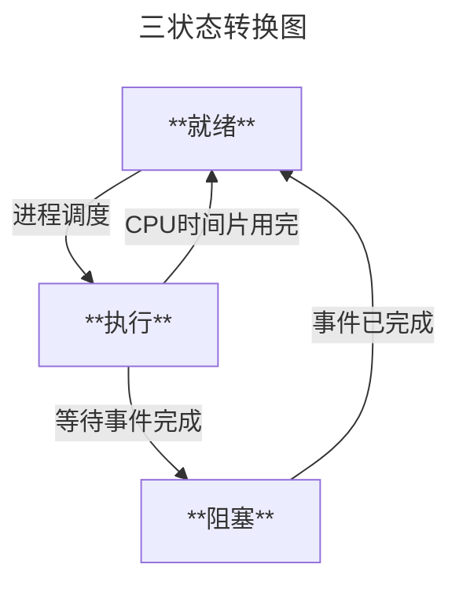
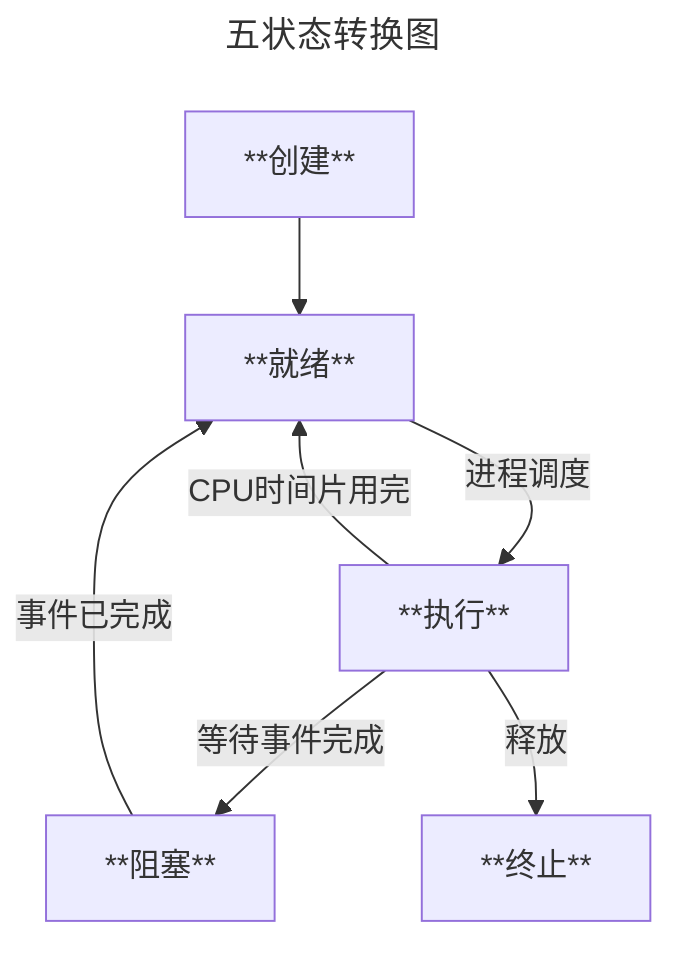

> 进程：资源分配的独立单位
> 线程：资源调度的独立单位

#### 进程之间私有和共享的资源

- 私有：地址空间、堆、全局变量、栈、寄存器
- 共享：代码段，公共数据，进程目录，进程 ID

#### 线程之间私有和共享的资源

- 私有：线程栈，寄存器，程序计数器
- 共享：堆，地址空间，全局变量，静态变量

[五分钟扫盲：进程与线程基础必知 - 知乎](https://zhuanlan.zhihu.com/p/403313422)
[Linux 原来这样完成了多任务切换](https://mp.weixin.qq.com/s/p9w8CDSABmUO-UV0oi9BIw)
[多进程编程知识汇总（附代码例子）](https://mp.weixin.qq.com/s/yJwXorK6VH1QQSNejZzODg)
[进程控制 \| 爱编程的大丙](https://subingwen.cn/linux/process/)

# 一、进程

### 1.1 进程概念

[可执行程序内存分配](Linux/可执行程序内存分配.md)

> 进程是程序的一次执行过程，程序是静态的，作为系统中的一种资源永远存在的。而进程是动态的，动态产生，变化和消亡的，拥有其自己的生命周期

**进程是程序在某个数据集合上的一次运行活动，也是操作系统进行资源分配和保护的基本单位**

### 1.2 进程组成

##### 1.2.1 进程控制块(PCB) -> 操作系统使用

- 进程 id：每一个进程都一个唯一的进程 ID，类型为 pid_t, 本质是一个整形数
- 进程的状态：进程有不同的状态, 状态是一直在变化的，有就绪、运行、挂起、停止等状态
- 进程对应的虚拟地址空间的信息
- 描述控制终端的信息，进程在哪个终端启动默认就和哪个终端绑定
- 当前工作目录：默认情况下, 启动进程的目录就是当前的工作目录
- umask 掩码：在创建新文件的时候，通过这个掩码屏蔽某些用于对文件的操作权限
- 文件描述符表：每个被分配的文件描述符都对应一个已经打开的磁盘文件
- 和信号相关的信息：在 Linux 中 调用函数, 键盘快捷键, 执行 shell 命令等操作都会产生信号
- 阻塞信号集：记录当前进程中阻塞哪些已产生的信号，使其不能被处理
- 未决信号集：记录在当前进程中产生的哪些信号还没有被处理掉
- 用户 id 和组 id：当前进程属于哪个用户, 属于哪个用户组
- 会话（Session）和进程组：多个进程的集合叫进程组，多个进程组的集合叫会话
- 进程可以使用的资源上限：可以使用 shell 命令 `ulimit -a` 查看详细信息

##### 1.2.2 数据段 -> 进程使用

- Data 段：初始化后的静态(全局)数据
- BSS 段：未初始化的静态(全局)数据

##### 1.2.3 程序段(Text)-> 进程使用

同一程序的进程此部分相同，只读的方式加载到内存中，可被多个进程安全共享

### 1.3 进程状态

[【操作系统】进程及进程的基本状态及转换图-CSDN 博客](https://blog.csdn.net/Jacky_Feng/article/details/108289943)

> 阻塞态是由于缺少需要的资源从而由运行态转换而来，但是该资源不包括 CPU 时间片，缺少 CPU 时间片会从运行态转换为就绪态
>
> 只有就绪态和运行态可以相互转换，其它的都是单向转换
> 1.3.1\~1.3.3 为三种基本状态；1.3.1\~1.3.5 为五种基本状态





##### 1.3.1 就绪态(ready)

进程具备运行条件，等待系统分配 CPU 即可立即运行

##### 1.3.2 运行态(running)

进程占用 CPU 运行中

##### 1.3.3 阻塞态(wait)

正在执行的进程由于等待某个事件完成而无法继续运行的状态

##### 1.3.4 新建态(new)

进程正在被创建时的状态

##### 1.3.5 终止态(exit)

进程正在从系统中消失时的状态

### 1.4 进程空间分布

[Linux 进程地址空间与进程内存布局详解 - 知乎](https://zhuanlan.zhihu.com/p/348171413)

Linux 系统进程的标准内存端布局：


32 位 Linux 的虚拟地址空间范围为 0 ～ 4G，Linux 内核将这 4G 字节的空间分为两部分， 将最高的 1G 字节（从虚拟地址 0xC0000000 到 0xFFFFFFFF）供内核使用，称为“内核空间”。而将较低的 3G 字节（从虚拟地址 0x00000000 到 0xBFFFFFFF）供各个进程使用，称为“用户空间。因为每个进程可以通过系统调用进入内核，因此，Linux 内核由系统内的所有进程共享。于是，从具体进程的角度来看，每个进程可以拥有 4G 字节的虚拟空间

不管是内核空间还是用户空间，它们都处于虚拟空间中。 虽然内核空间占据了每个虚拟空间中的最高 1GB 字节，但映射到物理内存却总是从最低地址（0x00000000），另外， 使用虚拟地址可以很好的保护内核空间被用户空间破坏，虚拟地址到物理地址转换过程由操作系统和 CPU 共同完成(操作系统为 CPU 设置好页表，CPU 通过 MMU 单元进行地址转换)

[操作系统 -- 虚拟地址与物理地址 - 牛犁 heart - 博客园](https://www.cnblogs.com/whiteBear/p/16299264.html)

每个进程最大能打开的文件数默认为 1024 个，标准输入、标准输出和错误输出的文件描述符为 0,1,2，后续打开的文件从 3 开始分配

同一进程中每打开一个文件，就会给这个文件分配一个新的文件描述符(即使打开的是同一个文件)

[文件描述符 \| 爱编程的大丙](https://subingwen.cn/linux/file-descriptor/)

##### 1.4.1 虚拟地址

可执行程序进程空间对应的地址，可用`objdump`反编译可执行文件得到对应汇编程序，其中左侧数据就是虚拟地址，该虚拟地址由**链接器**生成

##### 1.4.2 物理地址

内存条上的实际可寻址地址，即程序中变量在内存中的实际存储位置

##### 1.4.3 虚拟地址到物理地址的转换

- 转换函数: $p=f(v)$，其中 v 为虚拟地址，p 为物理地址
- 实现方式：内存管理单元(MMU) -> 硬件，将虚拟地址映射到真实物理地址上去；其中把虚拟地址空间和物理地址空间都分成同等大小的块，也称为页，按照虚拟页和物理页进行转换。根据软件配置不同，这个页的大小可以设置为 4KB、2MB、4MB、1GB，这样就进入了现代内存管理模式——分页模型

### 1.5 父子进程

[Linux 进程-----父进程与子进程（详细篇）-CSDN 博客](https://blog.csdn.net/qq_66337990/article/details/132589191)
[【Linux】撕开 fork 的本质，深入了解 fork 函数原理-CSDN 博客](https://blog.csdn.net/2403_86785171/article/details/141370035)
[关于 fork 函数中的内存复制和共享 - 黑翼天使 23 - 博客园](https://www.cnblogs.com/bwangel23/p/4190043.html)

> Linux 系统上使用 fork()创建子进程，刚创建出来的子进程和父进程"**几乎**"一模一样；每个进程只有一个父进程，但能有多个子进程，子进程复制父进程的数据空间(数据段)、栈和堆(当有数据修改时)，父、子进程共享正文段(代码段)
> 子进程的代码段、数据段和堆栈段通常会与父进程在内存中的位置相同，但是在物理内存中是独立的。操作系统使用了写时复制（Copy-On-Write，COW）机制来实现这一点。在子进程创建后，当父进程或子进程中的某个进程尝试修改它们的共享数据时，操作系统会将要修改的数据复制到新的物理内存页中，使得父子进程的数据修改不会互相干扰。所以子进程是和父进程先共用空间，到数据不同时在创建。
> 相当于只有发生数据更改时，子进程就会根据需要创建一块内存来存放与父进程不同的数据。因此，通过  `fork()`  函数创建的子进程实际上被放置在与父进程相同的虚拟地址空间中，但在物理内存中是独立的。这样可以节省内存空间，同时确保父子进程之间的独立性

##### 1.5.1 父进程与子进程

- 子进程与父进程相同的属性：

A)  实际  UID  和  GID，以及有效  UID  和  GID。
B)  所有环境变量。
C)  进程组  ID  和会话  ID。
D)  当前工作路径。除非用 chdir()加以修改
E)  打开的文件。
F)  信号响应函数。
G)  整个内存空间，包括栈、堆、数据段、代码段、标准  IO  的缓冲区等等。

- 子进程与父进程不同的属性：

A)  进程号  PID 。PID  是身份证号码，哪怕亲如父子，也要区分开。
B)  记录锁。父进程对某文件加了把锁，子进程不会继承这把锁。
C)  挂起的信号。这些信号是所谓的“悬而未决”的信号，等待着进程的响应，子进程也不会继承这些信号。

- 子进程会从 fork( )返回值后的下一条逻辑语句开始运行。这样就避免了不断调用 fork( )而产生无限子孙的悖论。

- 父子进程是相互平等的：他们的执行次序是随机的，或者说他们是并发运行的，除非使用特殊机制来同步他们，否则不能判断他们的运行究竟谁先谁后。

- 父子进程是相互独立的：由于子进程完整地复制了父进程的内存空间，因此从内存空间的角度看他们是相互独立、互不影响的。

### 1.6 进程上下文

[Linux：上下文，进程上下文和中断上下文概念，上下文切换-CSDN 博客](https://blog.csdn.net/lqy971966/article/details/119103989)
[到底什么是上下文切换？](https://mp.weixin.qq.com/s/Oh9jDTULSsRk0hNN_o5K4w)

处理器总处于以下三种状态之一：  
１、内核态，运行于进程上下文，内核代表进程运行于内核空间；  
２、内核态，运行于中断上下文，内核代表硬件运行于内核空间；  
３、用户态，运行于用户空间。

##### 1.6.1 进程上下文

可以看作是用户进程传递给内核的这些参数以及内核要保存的那一整套的变量、寄存器值和当时的环境等信息

##### 1.6.2 进程调度引起的进程切换(上下文切换)

当内核需要切换到另一个进程时，它需要保存当前进程的所有状态， 即保存当前进程的上下文，以便再次执行该进程时，能够回到切换时的状态继续执行下去

##### 1.6.3 进程上下文组成部分

- 用户级上下文：用户空间的数据、堆栈及共享存储区
- 寄存器上下文：通用寄存器、程序寄存器(IP)、处理器状态寄存器(EFLAGS)、栈指针(ESP)
- 系统级上下文：进程控制块 task_struct、内存管理信息(mm_struct、vm_area_struct、pgd、pte)、内核栈

##### 1.6.4 进程上下文切换 VS 系统调用

- 系统调用进程不会涉及进程切换，也不会涉及虚拟内存等系统资源切换，系统调用过程通常被称为**特权模式切换**，而不是**上下文切换**。但实际上，在系统调用过程中，CPU 的上下文切换也是不可避免的
- 进程上下文切换比系统调用多一步：在保存当前进程的内核状态和 CPU 寄存器之前，需要保存进程的虚拟内存、栈等；并加载下一个进程的内核状态
- 下文切换：进程/线程分时复用 CPU 时间片，在切换之前会将上一个任务的状态进行保存, 下次切换回这个任务的时候, **加载这个状态继续运行，任务从保存到再次加载这个过程就是一次上下文切换**

##### 1.6.5 上下文切换查看命令

- vmstat：查看整个系统的上下文切换情况
- pidstat：查看具体某个进程的上下文切换情况

### 1.7 孤儿进程、僵尸进程和守护进程

- [孤儿进程与僵尸进程[总结]](https://www.cnblogs.com/Anker/p/3271773.html)

> 在 Unix/Linux 系统中，正常情况下，除 init 进程外的其他进程都是通过父进程创建的，子进程又继续创建它的子进程。

##### 1.7.1 孤儿进程(由 init 处理，危害性不大)

当父进程因为某些原因没有等待创建的子进程退出就提前结束，此时的子进程就是孤儿进程，此时孤儿进程的父进程会变为 init 进程

如果 Linux 没有桌面终端，由 init 进程（PID=1）领养孤儿进程，如果有桌面终端，则由桌面进程领养(实际测试不一定由桌面进程领养，也可能是 init 进程)

##### 1.7.2 僵尸进程(占用进程号，危害性较大)

当子进程退出时，父进程没有调用 wait()或 waitpid()获取子进程状态信息，导致子进程的进程描述符等信息仍然存在于系统中，此时的子进程就是僵尸进程，直到父进程处理或者父进程被终止时才会消失；若父进程是死循环，那么该僵尸进程就会一直消耗内存空间和进程号

处理僵尸进程的方式：
[Linux 僵尸进程的处理方式 - Jcpeng_std - 博客园](https://www.cnblogs.com/JCpeng/p/15269661.html)

- 杀掉僵尸进程的父进程

```bash
# 查找僵尸进程相关信息
$ ps -e -o stat,ppid,pid,cmd | egrep '^[Zz]'
# 杀掉父进程pid号
$ kill -9 <ppid>
```

- 父进程中调用 wait()/waitpid()函数
- 父进程接收到 SIGCHLD 信号后调用 wait()/waitpid()函数对子进程进行处理，释放其子进程占用的资源 -> 当一个子进程终止或停止时，会向其父进程发送 SIGCHLD 信号。这个信号默认情况下会被忽略，但可以通过注册信号处理器来控制父进程释放子进程占用的资源

##### 1.7.3 守护进程

[【Linux】守护进程（ Daemon）的定义，作用，创建流程](https://blog.csdn.net/JMW1407/article/details/108412836)
[守护进程 \| 爱编程的大丙](https://subingwen.cn/linux/deamon/)

脱离终端在后台运行的程序，通常以 d 结尾，随系统启动而启动，父进程通常为 init 进程，可按照下面描述方法创建守护进程，也可通过库函数 daemon()创建守护进程

- 如何创建守护进程
  > 1.使用 fork()创建子进程并让父进程先于子进程结束，使子进程变为孤儿进程
  >
  > 2.在该孤儿进程中调用 setsid()函数创建**新的会话** ->使原本拷贝自父进程的会话、进程组和控制终端等信息的子进程独立出来
  >
  > 3.从子进程再次调用 fork()创建一个子进程(孙子进程)并结束掉原本的子进程，使得该孙子进程真正成为孤儿进程(守护进程)-> 有可能原本的父进程创建出子进程后因为某种原因阻塞，而子进程提前退出导致成为僵尸进程而非孤儿进程；而子进程再次创建孙子进程后立即退出，这时候可以保证孙子进程是孤儿进程而非僵尸进程
  >
  > 4.在孙子进程中调用 chdir()使根目录`/`成为该进程的工作目录(可选)
  >
  > 5.在孙子进程中调用 umask()设置进程文件权限掩码为 0(可选)
  >
  > 6.在孙子进程中关闭任何不需要的文件描述符，例如文件描述符为 0,1,2 的三个文件(标准输入、标准输出和标准错误输出)
  >
  > 7.处理守护进程的退出操作：编写代码实现 kill 发出的 signal 信号处理，实现该进程的正常退出

```c
//得到当前进程所在的进程组的组ID
pid_t getpgrp(void);
//获取指定的进程所在的进程组的组ID，参数 pid 就是指定的进程
pid_t getpgid(pid_t pid);
//将某个进程移动到其他进程组中或者创建新的进程组
int setpgid(pid_t pid, pid_t pgid);

#include <unistd.h>

// 获取某个进程所属的会话ID
pid_t getsid(pid_t pid);
// 将某个进程变成会话 =>> 得到一个守护进程
// 使用哪个进程调用这个函数, 这个进程就会变成一个会话
pid_t setsid(void);
```

### 1.8 进程创建函数

```c
#include <sys/types.h>
#include <unistd.h>

// 获取当前进程的进程ID
pid_t getpid(void);
// 获取当前进程的父进程ID
pid_t getppid(void);
// 创建一个新的进程
pid_t fork(void);

// 通过一个进程启动另一个进程 启动成功后该进程被其他进程替代
int execl(const char *path, const char *arg, ...
          /* (char  *) NULL */);
int execlp(const char *file, const char *arg, ...
           /* (char  *) NULL */);
int execle(const char *path, const char *arg, ...
           /*, (char *) NULL, char * const envp[] */);
int execv(const char *path, char *const argv[]);
int execvp(const char *file, char *const argv[]);
int execvpe(const char *file, char *const argv[],
            char *const envp[]);

// 结束进程函数
// 标准C库函数
#include <stdlib.h>
void exit(int status);

// Linux的系统函数
// 可以这么理解, 在linux中 exit() 函数 封装了 _exit()
#include <unistd.h>
void _exit(int status);

// 进程回收
// man 2 wait
#include <sys/wait.h>
// 阻塞进程
pid_t wait(int *status);

// 这个函数可以设置阻塞, 也可以设置为非阻塞
// 这个函数可以指定回收哪些子进程的资源
pid_t waitpid(pid_t pid, int *status, int options);
```

exec 族函数中最常用的有两个`execl()`和`execlp()`

一般在调用这些函数的时候都会先创建一个子进程，在子进程中调用 exec 族函数，子进程的用户区数据被替换掉开始执行新的程序中的代码逻辑，但是父进程不受任何影响仍然可以继续正常工作

### 中断上下文

- **中断上下文(原子上下文)，就是硬件传递过来的这些参数和内核需要保存的一些其他环境（主要是当前被打断执行的进程环境）**
- 中断上下文切换：在发生中断时,内核就在被中断进程的上下文中，在内核态下执行中断服务例程。但同时会保留所有需要用到的资源，以便中继服务结束时能恢复被中断进程的执行
- 与进程上下文不同，中断上下文切换不涉及进程的用户态，因此即使中断进程中断了处于用户态的进程，也不需要保存和恢复进程的虚拟内存、全局变量等用户态资源

# 二、线程

[线程 \| 爱编程的大丙](https://subingwen.cn/linux/thread/)

### 2.1 线程概念

> Linux 环境下线程本质仍然是进程
> 线程是操作系统能够进行运算调度的最小单位。它被包含在进程之中，是进程中的实际运作单位
> 一条线程指的是进程中一个单一顺序的控制流，一个进程中可以并发多个线程，每条线程并行执行不同的任务
> 在没有人为干预的情况下，**虚拟地址空间的生命周期和主线程是一样的**，与子线程无关

### 2.2 一个进程最多可以创建的线程数

[被问懵了：一个进程最多可以创建多少个线程？ - 小林 coding - 博客园](https://www.cnblogs.com/xiaolincoding/p/15013929.html)

一个进程可以创建的线程数由**进程的虚拟内存空间大小**和**系统参数**决定

在处理多任务程序的时候使用多线程比使用多进程要更有优势：

- 文件 IO 操作：文件 IO 对 CPU 是使用率不高, 因此可以分时复用 CPU 时间片, 线程个数 = 2 \* CPU 核心数 (效率最高)
- 处理复杂的算法(主要是 CPU 进行运算, 压力大)，线程个数 = CPU 核心数 (效率最高)

##### 32 位 Linux 系统

一个进程虚拟空间为 4G，内核 1G，用户 3G，进程创建线程时默认分配的栈空间大小可通过`ulimit -a`查看资源限制(stack size 为栈空间大小)，因此大致能计算出最多创建的线程数

##### 64 位 Linux 系统(实际使用 48 位的空间)

> 1EB=1024PB，1PB=1024TB，1TB=1024GB
> 一个进程虚拟空间为 16EB，内核 128T，用户 128T，中间未定义；
> 此时只看创建线程时分配的栈空间来计算线程数是不行的，因为有系统限制，可以从 Linux 下面这三个内核参数大小进行计算

- **_/proc/sys/kernel/threads-max_**，表示系统支持的最大线程数，默认值是  `14553`；
- **_/proc/sys/kernel/pid_max_**，表示系统全局的 PID 号数值的限制，每一个进程或线程都有 ID，ID 的值超过这个数，进程或线程就会创建失败，默认值是  `32768`；
- **_/proc/sys/vm/max_map_count_**，表示限制一个进程可以拥有的 VMA(虚拟内存区域)的数量，如果它的值很小，也会导致创建线程失败，默认值是  `65530`

### 2.3 线程同步和互斥

- [线程同步和互斥的区别](https://www.cnblogs.com/baizhanshi/p/6844356.html "发布于 2017-05-12 10:32")
- [多线程的同步与互斥（互斥锁、条件变量、读写锁、自旋锁、信号量）](https://blog.csdn.net/daaikuaichuan/article/details/82950711)
- [多线程同步的四种方式（史上最详细+用例） - Chilk - 博客园](https://www.cnblogs.com/Chlik/p/13556720.html)
- [线程同步 \| 爱编程的大丙](https://subingwen.cn/linux/thread-sync/)

> 在多任务操作系统中，同时运行多个任务，它们可能**都需要使用同一种资源**、**任务间有依赖关系，某个任务运行依赖于另一个任务**

##### 2.3.1 线程同步(条件变量、读写锁、自旋锁、信号量)

> 线程同步是多个线程间按照一系列步骤共同完成一个任务，比如说线程 A 执行完的结果 result_A 给线程 B，线程 B 接着执行代码后得到的结果 result_B 给线程 C，线程 C 接着执行代码得到最终结果
>
> 一般情况下，同步关系中往往包含互斥，同时对临界区的资源会按照某种逻辑顺序进行访问
>
> 一般情况下，每一个共享资源对应一个把互斥锁，锁的个数和线程的个数无关

- **互斥锁**

```c
pthread_mutex_t  mutex;

// 初始化互斥锁
// restrict: 是一个关键字, 用来修饰指针, 只有这个关键字修饰的指针可以访问指向的内存地址, 其他指针是不行的
int pthread_mutex_init(pthread_mutex_t *restrict mutex,
           const pthread_mutexattr_t *restrict attr);
// 释放互斥锁资源
int pthread_mutex_destroy(pthread_mutex_t *mutex);

// 修改互斥锁的状态, 将其设定为锁定状态, 这个状态被写入到参数 mutex 中 阻塞加锁
int pthread_mutex_lock(pthread_mutex_t *mutex);

// 尝试加锁 非阻塞加锁
int pthread_mutex_trylock(pthread_mutex_t *mutex);

// 对互斥锁解锁
int pthread_mutex_unlock(pthread_mutex_t *mutex);
```

- **读写锁**
  读写锁是互斥锁的升级版, 在做读操作的时候可以提高程序的执行效率，如果所有的线程都是做读操作, 那么读是并行的，但是使用互斥锁，读操作也是串行的(写锁比读锁的优先级高)

```c
#include <pthread.h>
pthread_rwlock_t rwlock;

// 初始化读写锁
int pthread_rwlock_init(pthread_rwlock_t *restrict rwlock,
           const pthread_rwlockattr_t *restrict attr);
// 释放读写锁占用的系统资源
int pthread_rwlock_destroy(pthread_rwlock_t *rwlock);

// 在程序中对读写锁加读锁, 锁定的是读操作
int pthread_rwlock_rdlock(pthread_rwlock_t *rwlock);
// 这个函数可以有效的避免死锁
// 如果加读锁失败, 不会阻塞当前线程, 直接返回错误号
int pthread_rwlock_tryrdlock(pthread_rwlock_t *rwlock);

// 在程序中对读写锁加写锁, 锁定的是写操作
int pthread_rwlock_wrlock(pthread_rwlock_t *rwlock);
// 这个函数可以有效的避免死锁
// 如果加写锁失败, 不会阻塞当前线程, 直接返回错误号
int pthread_rwlock_trywrlock(pthread_rwlock_t *rwlock);

// 解锁, 不管锁定了读还是写都可用解锁
int pthread_rwlock_unlock(pthread_rwlock_t *rwlock);
```

- **条件变量**
  严格来说，条件变量的主要作用不是处理线程同步, 而是进行线程的阻塞，一般情况下条件变量用于处理生产者和消费者模型，并且和互斥锁配合使用

```c
#include <pthread.h>
pthread_cond_t cond;
// 初始化
int pthread_cond_init(pthread_cond_t *restrict cond,
      const pthread_condattr_t *restrict attr);
// 销毁释放资源
int pthread_cond_destroy(pthread_cond_t *cond);

// 线程阻塞函数, 哪个线程调用这个函数, 哪个线程就会被阻塞
int pthread_cond_wait(pthread_cond_t *restrict cond, pthread_mutex_t *restrict mutex);

// 表示的时间是从1971.1.1到某个时间点的时间, 总长度使用秒/纳秒表示
struct timespec {
	time_t tv_sec;      /* Seconds */
	long   tv_nsec;     /* Nanoseconds [0 .. 999999999] */
};
// 将线程阻塞一定的时间长度, 时间到达之后, 线程就解除阻塞了
int pthread_cond_timedwait(pthread_cond_t *restrict cond,
           pthread_mutex_t *restrict mutex, const struct timespec *restrict abstime);

// 唤醒阻塞在条件变量上的线程, 至少有一个被解除阻塞
int pthread_cond_signal(pthread_cond_t *cond);
// 唤醒阻塞在条件变量上的线程, 被阻塞的线程全部解除阻塞
int pthread_cond_broadcast(pthread_cond_t *cond);


```

- **信号量**

```c
#include <semaphore.h>
sem_t sem;

// 初始化信号量/信号灯
int sem_init(sem_t *sem, int pshared, unsigned int value);
// 资源释放, 线程销毁之后调用这个函数即可
// 参数 sem 就是 sem_init() 的第一个参数
int sem_destroy(sem_t *sem);

// 参数 sem 就是 sem_init() 的第一个参数
// 函数被调用sem中的资源就会被消耗1个, 资源数-1
int sem_wait(sem_t *sem);

// 参数 sem 就是 sem_init() 的第一个参数
// 函数被调用sem中的资源就会被消耗1个, 资源数-1
int sem_trywait(sem_t *sem);

// 表示的时间是从1971.1.1到某个时间点的时间, 总长度使用秒/纳秒表示
struct timespec {
	time_t tv_sec;      /* Seconds */
	long   tv_nsec;     /* Nanoseconds [0 .. 999999999] */
};
// 调用该函数线程获取sem中的一个资源，当资源数为0时，线程阻塞，在阻塞abs_timeout对应的时长之后，解除阻塞。
// abs_timeout: 阻塞的时间长度, 单位是s, 是从1970.1.1开始计算的
int sem_timedwait(sem_t *sem, const struct timespec *abs_timeout);

// 调用该函数给sem中的资源数+1
int sem_post(sem_t *sem);
// 查看信号量 sem 中的整形数的当前值, 这个值会被写入到sval指针对应的内存中
// sval是一个传出参数
int sem_getvalue(sem_t *sem, int *sval);
```

[《C++ 并发编程实战 第二版》：条件变量唤醒丢失与虚假唤醒](https://blog.csdn.net/qq_39354847/article/details/126432944)

- 伪唤醒

  > 1.由于被唤醒线程还没有执行到`wait`语句被挂起等待，唤醒线程就已经发送了唤醒信号，这时唤醒信号将会丢失、被唤醒线程将会一直阻塞
  >
  > 2.对于共享数据的访问没有加锁

- 虚假唤醒

  > 1.当一个正在等待条件变量的线程由于条件变量被触发而唤醒时，却发现它等待的条件（共享数据）没有满足(也就是没有共享数据)
  >
  > 2.为了给操作系统提供处理错误情况和（线程）竞争实现（更大的）灵活性，条件变量即使没有被触发，它也可能被允许返回(但 Linux 的 pthread 保证不会出现该种虚假唤醒)

  对于上面两个可能造成虚假唤醒的情况，我们应当使用`while`循环而不是`if`条件来判断等待的条件是否满足

##### 2.3.2 线程互斥(互斥锁、信号量)

> 线程互斥是指某一资源**同时**只允许一个线程访问(具有唯一性和排它性)，但线程互斥无法限制线程对资源的访问顺序(无序访问)
>
> 不同线程通过竞争得到资源访问权(进入临界区->共享数据和硬件资源)，为防止访问冲突，在有限时间内只允许其中一个线程独占性的使用该资源

##### 2.3.3 同步和互斥区别

- 互斥是通过竞争实现资源的独占使用，线程彼此间不需要知道彼此的存在，各个线程乱序执行
- 同步是协调多个关联线程合作完成任务，线程彼此间知道对方存在，各个线程往往是有序执行的

### 2.4 线程函数

```c
#include <pthread.h>

// 返回当前线程的线程ID
pthread_t pthread_self(void);

// 创建线程
int pthread_create(pthread_t *thread, const pthread_attr_t *attr,
                   void *(*start_routine) (void *), void *arg);
// 编译时加上-pthread, 线程库的名字叫pthread, 全名: libpthread.so libptread.a

// 线程分离
int pthread_detach(pthread_t thread);

// 线程取消
// 主线程调用线程取消函数，只要在子线程中进行了系统调用，当子线程执行到这个位置就结束掉了
int pthread_cancel(pthread_t thread);

// 线程ID比较
int pthread_equal(pthread_t t1, pthread_t t2);

// 退出线程 通过retval传递参数
void pthread_exit(void *retval);

// 线程回收 通过retval传递参数
// 这是一个阻塞函数, 子线程在运行这个函数就阻塞
// 子线程退出, 函数解除阻塞, 回收对应的子线程资源, 类似于回收进程使用的函数 wait()
int pthread_join(pthread_t thread, void **retval);
```

子线程数据回收方法

- 全局变量和堆区数据
- 主线程栈(主线程最后退出时适用)

# 三、进程间通信方式及其优缺点

[全网最全、最详细的 Linux 进程间通信方式讲解来了，你不容错过！](https://mp.weixin.qq.com/s/-HapLBJIrV6BULzpaqVw4w)
[内存映射(mmap) \| 爱编程的大丙](https://subingwen.cn/linux/mmap/)


管道对应的内存空间在内核中，而内存映射区对应的内存空间在进程的用户区（用于加载动态库的那个区域）即进程间通信使用的内存映射区不是一块，而是在每个进程内部都有一块(==内存映射区与共享内存不同==)


```c
#include <sys/mman.h>
// 创建内存映射区
1. 第一个参数 addr 指定为 NULL 即可
2. 第二个参数 length 必须要 > 0
3. 第三个参数 prot，进程间通信需要对内存映射区有读写权限，因此需要指定为：PROT_READ | PROT_WRITE
4. 第四个参数 flags，如果要进行进程间通信, 需要指定 MAP_SHARED
5. 第五个参数 fd，打开的文件必须大于0，进程间通信需要文件操作权限和映射区操作权限相同
     - 内存映射区创建成功之后, 关闭这个文件描述符不会影响进程间通信
6. 第六个参数 offset，不偏移指定为0，如果偏移必须是4k的整数倍
void *mmap(void *addr, size_t length, int prot, int flags, int fd, off_t offset);

// 释放内存映射区
int munmap(void *addr, size_t length);
```

- 有血缘关系的进程：创建子进程会发生虚拟地址空间的复制，那么在父进程中创建的内存映射区也会被复制到子进程中，这样在子进程里边就可以直接使用这块内存映射区了，所以对于有血缘关系的进程，进行进程间通信是非常简单的
- 没有血缘关系的进程：需要在每个进程中分别创建内存映射区，但是这些进程的内存映射区必须要关联相同的磁盘文件，这样才能实现进程间的数据同步

使用内存映射区拷贝文件思路：

- 打开被拷贝文件，得到文件描述符 fd1，并计算出这个文件的大小 size
- 创建内存映射区 A 并且和被拷贝文件关联，也就是和 fd1 关联起来，得到映射区地址 ptrA
- 创建新文件，得到文件描述符 fd2，用于存储被拷贝的数据，并且将这个文件大小拓展为 size
- 创建内存映射区 B 并且和新创建的文件关联，也就是和 fd2 关联起来，得到映射区地址 ptrB
- 进程地址空间之间的数据拷贝，memcpy（ptrB， ptrA，size），数据自动同步到新建文件中
- 关闭内存映射区

### 3.1 管道(PIPE)--> 半双工通信

管道的两端默认是阻塞的，可以通过 fcntl 修改为非阻塞的读写

##### 命名管道

- 优点：允许不同进程间的通信
- 缺点
  - 长期存在，使用不当容易出错
  - 缓冲区有限

```c
#include <sys/types.h>
#include <sys/stat.h>
// 创建命名管道
// int open(const char *pathname, int flags, mode_t mode);
int mkfifo(const char *pathname, mode_t mode);

// 读管道
ssize_t read(int fd, void *buf, size_t count);
// 写管道的函数
ssize_t write(int fd, const void *buf, size_t count);
```

```c
// 写管道进程的步骤
/*
	1. 创建有名管道文件
		mkfifo()
	2. 打开有名管道文件, 打开方式是 o_wronly
		int wfd = open("xx", O_WRONLY);
	3. 调用write函数写文件 ==> 数据被写入管道中
		write(wfd, data, strlen(data));
	4. 写完之后关闭文件描述符
		close(wfd);
*/

// 读管道进程的步骤
/*
	1. 这两个进程需要操作相同的管道文件
	2. 打开有名管道文件, 打开方式是 o_rdonly
		int rfd = open("xx", O_RDONLY);
	3. 调用read函数读文件 ==> 读管道中的数据
		char buf[4096];
		read(rfd, buf, sizeof(buf));
	4. 读完之后关闭文件描述符
		close(rfd);
*/
```

##### 匿名管道

- 优点：简单方便
- 缺点
  - 只能在具有亲缘关系的进程间通信
  - 缓冲区有限

```c
#include <unistd.h>
// 创建一个匿名的管道, 得到两个可用的文件描述符
int pipe(int pipefd[2]);
```

将默认输出到终端的数据写入到管道就需要进行输出的重定向，需要使用 dup2()做这件事情：`dup2(fd[1], STDOUT_FILENO);`

##### 管道的读写行为

- 读管道，需要根据写端的状态进行分析：
  - 写端没有关闭 (操作管道写端的文件描述符没有被关闭)
    - 如果管道中没有数据 ==> 读阻塞, 如果管道中被写入了数据, 阻塞解除
    - 如果管道中有数据 ==> 不阻塞，管道中的数据被读完了, 再继续读管道还会阻塞
  - 写端已经关闭了 (没有可用的文件描述符可以写管道了)
    - 管道中没有数据 ==> 读端解除阻塞, read 函数返回 0
    - 管道中有数据 ==> read 先将数据读出, 数据读完之后返回 0, 不会阻塞了
- 写管道，需要根据读端的状态进行分析：
  - 读端没有关闭
    - 如果管道有存储的空间, 一直写数据
    - 如果管道写满了, 写操作就阻塞, 当读端将管道数据读走了, 解除阻塞继续写
  - 读端关闭了，管道破裂(异常), 进程直接退出

### 3.2 信号量(Semaphore)

> 计数器，控制多个进程对共享资源的访问

- 优点：实现进程同步
- 缺点：信号量有限

### 3.3 信号(Signal)

> 较为复杂的通信方式，通知进程某个事件已经发生

[信号 \| 爱编程的大丙](https://subingwen.cn/linux/signal/)

```bash
# 执行shell命令查看信号
$ kill -l
 1) SIGHUP       2) SIGINT       3) SIGQUIT      4) SIGILL       5) SIGTRAP
 2) SIGABRT      7) SIGBUS       8) SIGFPE       9) SIGKILL     10) SIGUSR1
3) IGSEGV     12) SIGUSR2     13) SIGPIPE     14) SIGALRM     15) SIGTERM
4) IGSTKFLT   17) SIGCHLD     18) SIGCONT     19) SIGSTOP     20) SIGTSTP
5) IGTTIN     22) SIGTTOU     23) SIGURG      24) SIGXCPU     25) SIGXFSZ
6) IGVTALRM   27) SIGPROF     28) SIGWINCH    29) SIGIO       30) SIGPWR
7) IGSYS      34) SIGRTMIN    35) SIGRTMIN+1  36) SIGRTMIN+2  37) SIGRTMIN+3
8) IGRTMIN+4  39) SIGRTMIN+5  40) SIGRTMIN+6  41) SIGRTMIN+7  42) SIGRTMIN+8
9) IGRTMIN+9  44) SIGRTMIN+10 45) SIGRTMIN+11 46) SIGRTMIN+12 47) SIGRTMIN+13
10) IGRTMIN+14 49) SIGRTMIN+15 50) SIGRTMAX-14 51) SIGRTMAX-13 52) SIGRTMAX-12
11) IGRTMAX-11 54) SIGRTMAX-10 55) SIGRTMAX-9  56) SIGRTMAX-8  57) SIGRTMAX-7
12) IGRTMAX-6  59) SIGRTMAX-5  60) SIGRTMAX-4  61) SIGRTMAX-3  62) SIGRTMAX-2
13) IGRTMAX-1  64) SIGRTMAX
```

Linux 中的信号有三种状态，分别为：产生，未决，递达。

- 产生：键盘输入, 函数调用, 执行 shell 命令, 对硬件进行非法访问等操作都会产生信号
- 未决：信号产生了, 但是这个信号还没有被处理掉, 这个期间信号的状态称之为未决状态
- 递达：信号被处理了(被某个进程处理掉)

当子进程退出、暂停、从暂停回复运行的时候，在子进程中会产生一个 SIGCHLD 信号，并将其发送给父进程，但是父进程收到这个信号之后默认就忽略了。我们可以在父进程中对这个信号加以利用，基于这个信号来回收子进程的资源

```c
#include <signal.h>
// 给某一个进程发送一个信号
int kill(pid_t pid, int sig);
// 参数就是要给当前进程发送的信号
int raise(int sig);

// 中断函数, 发送一个固定信号 (SIGABRT)杀死当前进程
#include <stdlib.h>
void abort(void);

#include <unistd.h>
// 倒计时seconds秒, 倒计时完成发送信号 SIGALRM , 当前进程会收到这个信号，这个信号默认的处理动作是中断当前进程
unsigned int alarm(unsigned int seconds);

#include <signal.h>
// 在信号产生之前, 提供一个注册函数, 用来捕捉信号
//	  - 假设在将来这个信号产生了, 就委托内核进行捕捉, 这个信号的默认动作就不能被执行
//	  - 执行什么样的处理动作 ==> 在signal函数中指定的处理动作
//	  - 如果这个信号不产生, 回调函数永远不会被调用
sighandler_t signal(int signum, sighandler_t handler);
```

### 3.4 消息队列(Message Queue)

> 链表形式的消息，存放在内核中并由消息队列标识符标识

- 优点：允许不同进程间的通信，由系统调用函数实现消息收发同步，无需考虑同步问题
- 缺点：消息复制需要额外消耗 CPU 的时间，不适宜于信息量大或操作频繁的场合

### 3.5 共享内存(Shared Memory)

> 映射一段能被其他进程所访问的内存，这段共享内存由一个进程创建，但多个进程都可以访问

- 优点：不用复制，通信信息量大
- 缺点
  - 通信是通过将共享空间缓冲区直接附加到进程的虚拟地址空间中来实现的，需要考虑进程间的读写同步问题
  - 利用内存缓冲区直接交换信息，只能同一个计算机系统中的诸多进程共享，不方便网络通信

[共享内存 \| 爱编程的大丙](https://subingwen.cn/linux/shm/)

```c
#include <sys/ipc.h>
#include <sys/shm.h>
// 创建/打开共享内存
int shmget(key_t key, size_t size, int shmflg);

// ftok函数原型 用于shmget()的key
#include <sys/types.h>
#include <sys/ipc.h>
// 将两个参数作为种子, 生成一个 key_t 类型的数值
key_t ftok(const char *pathname, int proj_id);

// 关联和解除关联共享内存
void *shmat(int shmid, const void *shmaddr, int shmflg);
int shmdt(const void *shmaddr);

// 共享内存控制函数
int shmctl(int shmid, int cmd, struct shmid_ds *buf);
```

shmctl() 函数是一个多功能函数，可以设置、获取共享内存的状态也可以将共享内存标记为删除状态。当共享内存被标记为删除状态之后，并不会马上被删除，直到所有的进程全部和共享内存解除关联，共享内存才会被删除

使用共享内存实现进程间通信操作流程：

1. 调用 linux 的系统 API 创建一块共享内存
   - 这块内存不属于任何进程, 默认进程不能对其进行操作
2. 准备好进程 A, 和进程 B, 这两个进程需要和创建的共享内存进行关联
   - 关联操作: 调用 linux 的 api
   - 关联成功之后, 得到了这块共享内存的起始地址
3. 在进程 A 或者进程 B 中对共享内存进行读写操作
   - 读内存: printf() 等;
   - 写内存: memcpy() 等;
4. 通信完成, 可以让进程 A 和 B 和共享内存解除关联
   - 解除成功, 进程 A 和 B 不能再操作共享内存了
   - 共享内存不受进程生命周期的影响的
5. 共享内存不在使用之后, 将其删除
   - 调用 linux 的 api 函数, 删除之后这块内存被内核回收了

共享内存和内存映射区都可以实现进程间通信，二者的区别：

- 实现进程间通信的方式
  - shm: 多个进程只需要一块共享内存就够了，共享内存不属于进程，需要和进程关联才能使用
  - 内存映射区: 位于每个进程的虚拟地址空间中, 并且需要关联同一个磁盘文件才能实现进程间数据通信
- 效率
  - shm: 直接对内存操作，效率高
  - 内存映射区: 需要内存和文件之间的数据同步，效率低
- 生命周期
  - 内存映射区：进程退出, 内存映射区也就没有了
  - shm：进程退出对共享内存没有影响，调用相关函数/命令/ 关机才能删除共享内存
- 数据的完整性 -> 突发状态下数据能不能被保存下来（比如: 突然断电）
  - 内存映射区：可以完整的保存数据, 内存映射区数据会同步到磁盘文件
  - shm：数据存储在物理内存中, 断电之后系统关闭, 内存数据也就丢失了

### 3.6 套接字(Socket)

[套接字-Socket \| 爱编程的大丙](https://subingwen.cn/linux/socket/)

套接字可以分为网络套接字和域套接字 (Unix Domain Sockets)

域套接字（Unix Domain Sockets）是一种在同一台机器上的进程间进行数据通信的机制。相对于网络套接字，它们提供了更高效的本地通信方式，**因为数据不需要经过网络协议栈**。域套接字支持流（类似 TCP）和数据报（类似 UDP）两种模式

**特别说明**：在域套接字通信中，**“不经过网络协议栈”**  指的是数据传输不需要 IP 层的路由、不需要 TCP/UDP 等传输层协议的封包与解包处理，也不需要网络接口层的参与。这一点与网络套接字不同，后者用于跨网络的通信，需要经过完整的网络协议栈处理，包括数据的封装、传输、路由和解封装等

- 优点
  - 传输数据为字节级，数据量小效率高
  - 传输数据时间短，性能高
  - 适合于客户端和服务器端之间信息的实时交互
  - 可以加密，数据安全性强
- 缺点：需对传输的数据进行解析，转化成应用层的数据

### 3.7 文件(Files)

文件在 Linux 系统中是一种基本的持久化存储机制，可用于**进程间通信**。多个进程可以通过对同一个文件的读取和写入来共享信息

如果存在多个写进程同时操作同一个文件，那么会引发数据竞态和一致性问题。为了解决这个问题，可以使用文件锁或其他同步机制来协调对文件的访问，确保数据的完整性和一致性

# 四、线程间通信方式

> 主要目的是进行线程同步，所以线程没有像进程通信中的用于数据交换的通信机制

### 4.1 锁机制

- 互斥锁/互斥量：以排他方式防止数据结构被并发修改的方法
- 读写锁：允许多个线程同时读共享数据，而对写操作是互斥的
- 自旋锁：类似于互斥锁；互斥锁是当资源被占用，申请者进入睡眠状态；而自旋锁则循环检测保持者是否已经释放锁
- 条件变量：以原子的方式阻塞进程，直到某个特定条件为真为止。对条件的测试是在互斥锁的保护下进行的，条件变量始终与互斥锁一起使用

### 4.2 信号量机制

- 无名线程信号量
- 命名线程信号量

### 4.3 信号机制

### 4.4 屏障

允许每个线程等待，直到所有的合作线程都达到某一点，然后从该点继续执行

# 五、多进程与多线程对比、优劣

| 对比维度       | 多进程                                                           | 多线程                                                         | 总结     |
| -------------- | ---------------------------------------------------------------- | -------------------------------------------------------------- | -------- |
| 数据共享、同步 | 数据共享复杂，需要用 IPC；数据是分开的，同步简单                 | 因为共享进程数据，数据共享简单，但也是因为这个原因导致同步复杂 | 各有优势 |
| 内存、CPU      | 占用内存多，切换复杂，CPU 利用率低                               | 占用内存少，切换简单，CPU 利用率高                             | 线程占优 |
| 创建销毁、切换 | 创建销毁和切换复杂，速度慢                                       | 创建销毁和切换简单，速度很快                                   | 线程占优 |
| 编程、调试     | 编程简单，调试简单                                               | 编程复杂，调试复杂                                             | 进程占优 |
| 可靠性         | 进程间不会互相影响                                               | 一个线程挂掉将导致整个进程挂掉                                 | 进程占优 |
| 分布式         | 适应于多核、多机分布式；如果一台机器不够，扩展到多台机器比较简单 | 适应于多核分布式                                               | 进程占优 |

| 优劣 | 多进程                                   | 多线程                                   |
| ---- | ---------------------------------------- | ---------------------------------------- |
| 优点 | 编程、调试简单，可靠性较高               | 创建、销毁、切换速度快，内存、资源占用小 |
| 缺点 | 创建、销毁、切换速度慢，内存、资源占用大 | 编程、调试复杂，可靠性较差               |

# 六、Linux 内核同步方式

[详解 Linux 最高效进程通信-共享内存的同步问题](https://mp.weixin.qq.com/s/tVEOK8mKn5BvEN1Wgu-J6w)

> 在现代操作系统里，同一时间可能有多个内核执行流在执行，因此内核其实像多进程多线程编程一样也需要一些同步机制来同步各执行单元对共享数据的访问。尤其是在多处理器系统上，更需要一些同步机制来同步不同处理器上的执行单元对共享的数据的访问

### 6.1 同步方式

- 原子操作
- 信号量（semaphore）
- 读写信号量（rw_semaphore）
- 自旋锁（spinlock）
- 大内核锁（BKL，Big Kernel Lock）
- 读写锁（rwlock）
- 大读者锁（brlock-Big Reader Lock）
- 读-拷贝修改(RCU，Read-Copy Update)
- 顺序锁（seqlock）

System V 信号量(经典但较古老)：通过`semop`控制信号量值(P/V 操作)
POSIX 信号量(推荐)：支持命名信号量(无关进程可访问)，`sem_wait`和`sem_post`
共享内存中的互斥锁(高效但需谨慎)：将互斥锁直接放在共享内存中，`pthread_mutex_lock`与`pthread_mutex_unlock`
文件锁(fcntl，冷门但灵活)：可锁整个文件或部分区域

### 6.2 死锁

[死锁和产生死锁的四个必要条件以及如何避免和预防死锁-CSDN 博客](https://blog.csdn.net/ypt523/article/details/81509454)

##### 6.2.1 死锁定义

两个进程，每个进程都在等待对方进程才能引发的事件(等待对方进程释放锁)，此时这两个进程就是死锁的

##### 6.2.2 死锁产生原因

- 系统资源的竞争，导致系统资源不足及分配不当，最终形成死锁
- 进程运行过程中，请求和释放资源顺序不当，会形成死锁

具体场景如下几种：

- 加锁之后忘记解锁
- 重复加锁, 造成死锁
- 在程序中有多个共享资源, 因此有很多把锁，随意加锁，导致相互被阻塞

##### 6.2.3 死锁产生的**必要条件**

- 互斥条件：多个进程对于同一资源的访问是互斥的
- 请求与保持条件：进程持有至少一个资源再发起其他资源请求被阻塞时，已获得资源保持不放
- 不可剥夺条件：进程获得的资源只能主动释放，不能被其他进程强行剥夺
- 循环等待条件：多个进程首尾相接循环等待资源

##### 6.2.4 避免死锁的方法

- 打破互斥条件：改造独占性资源为虚拟资源，大部分资源已无法改造。
- 打破不可抢占条件：当一进程占有一独占性资源后又申请一独占性资源而无法满足，则释放原来占有的资源。
- 打破占有且申请条件：采用资源预先分配策略，即进程运行前申请全部资源，满足则运行，否则等待，这样就不会占有且申请。
- 打破循环等待条件：实现资源有序分配策略，对所有设备实现分类编号，所有进程只能采用按序号递增的形式申请资源。
- 有序资源分配法
- 银行家算法
